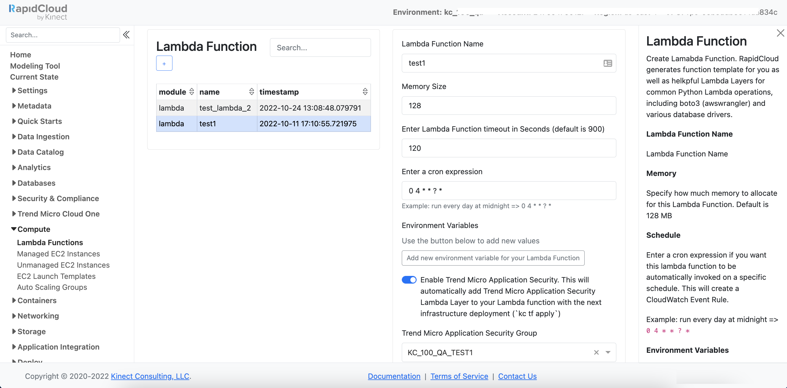

## RapidCloud Lambda Module Example

Example Lambda Module

For detailed Custom Modules documentation, please visit https://rapid-cloud.io/custom-modules/

Lambda module has one command: `kc lambda create`

### RapidCloud Lambda Module CLI:

### RapidCloud Lambda Module Console:

