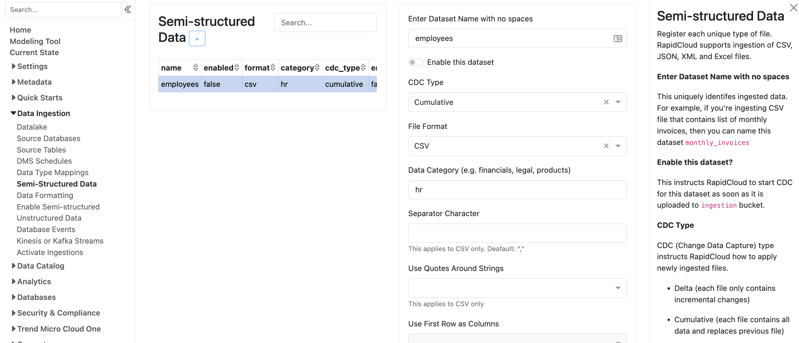
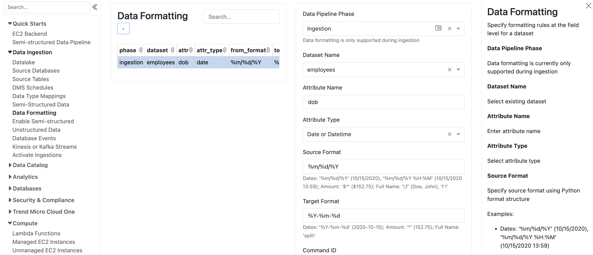
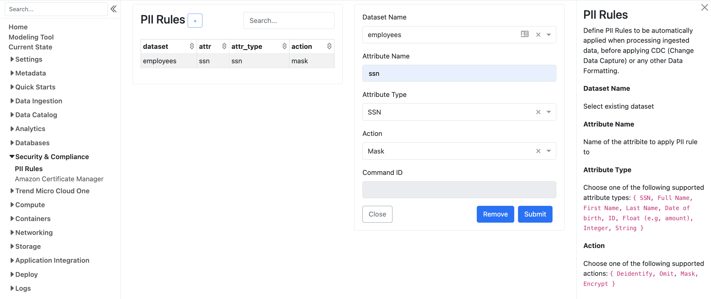
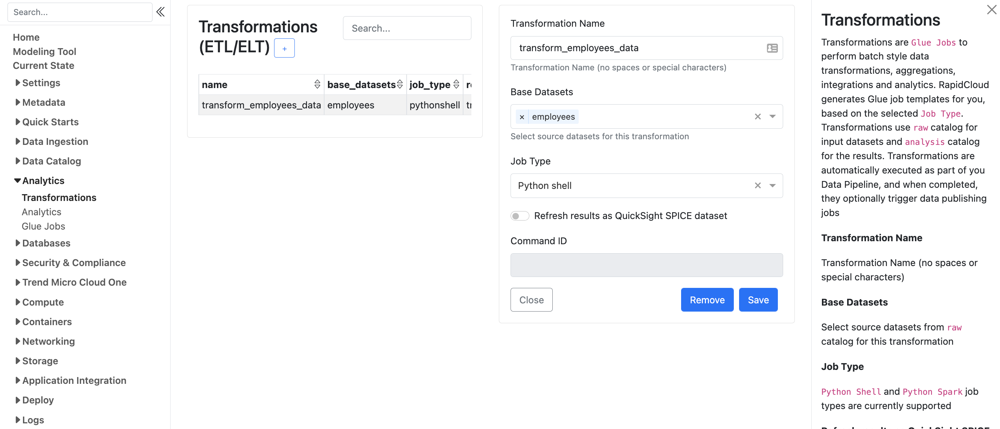
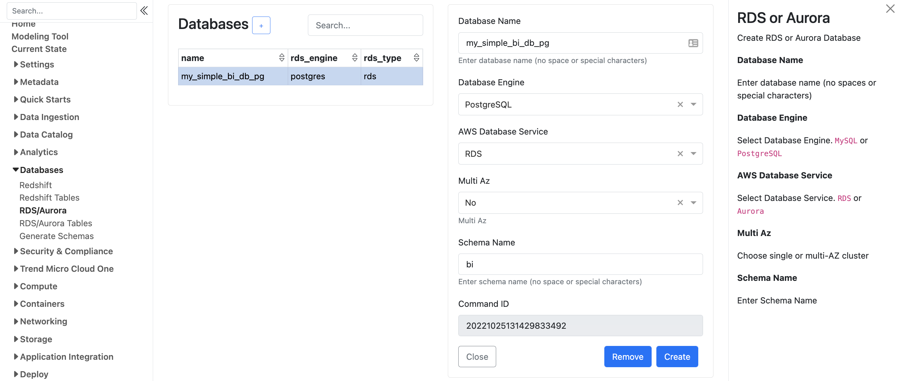
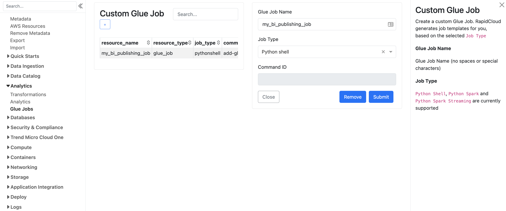

# How to create a complete data pipeline for semi-structured files

RapidCloud includes a set of modules for creating end-to-end data pipelines for semi-structured files (e.g. JSON, CSV). It includes CDC (change data capture), transformations, and publishing to RDS database (MySQL or Postgres) for your BI needs.

## Add metadata for every file

Navigate to `Data Ingestion` -> `Semi-structured Data`, click the `'+'` icon and fill out a simple form. This will capture metadata for the files to be ingested and processed. Do this for every file you plan to process. For example, if you intend to ingest a transactions csv file and a product changes json file on a daily basis, then add two files to your `Semi-structured Data`

## Add formatting rules for each of the files (optional)

- Do you need to convert some data to a canonical format? 
- Are dates formatted differently in different files?
- Do you need to split full name into first name and last name?

RapidCloud Data Formatting is a simple way to configure your formatting needs. Once configured, it will be applied automatically.

## Add PII Rules (optional)

Do you have specific compliance requirements (HIPAA, PCI, etc)?

RapidCloud PII Rules is a simple way to configure PII rules to your datasets. Once configured, they will be applied automatically.

## Add Transformations  (optional)

Once you configure your ingestion metadata, you're ready to create transformatins. Transformations are Glue jobs that perform your desired business logic to enrich, integrate, aggregate your data before it gets published to your target database, data mart, data warehouse or data lake location.

## Add a target database, data mart, or data warehouse (optional)

Your transformed data is stored in your data lake for conveniuent data exploration, Athena queries or other types of data tools that support S3 as the underlying data storage. If you need to publish your data to an RDS or Aurora database, or Redshift, you need to add target data store. This will create appropriate data store configuration as well as automatic workflow trigger mechanism via SNS and Lambda functions to start the publishing jobs.

## Add publishing Glue job (optional)

You have two options here. Either add a generic Custom Glue Job to handle any transformation results and modify run_publishing Lambda function. 

Or add individual tables to publishing workflow.

